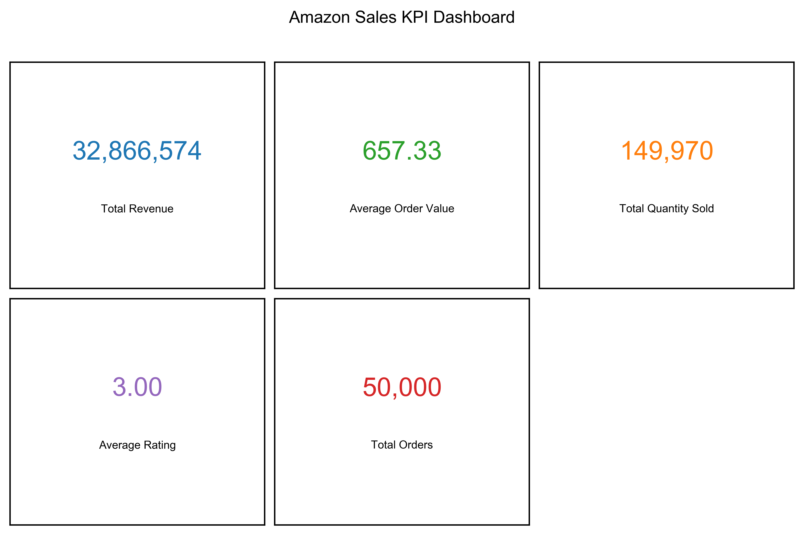
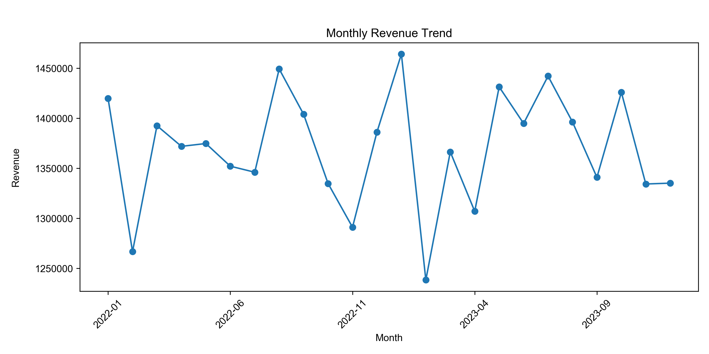
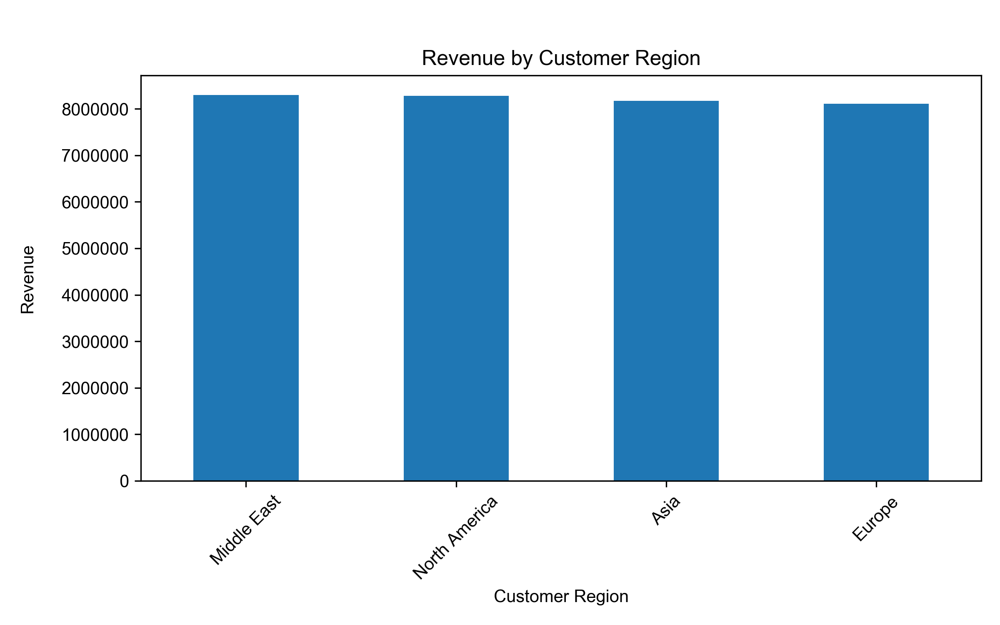
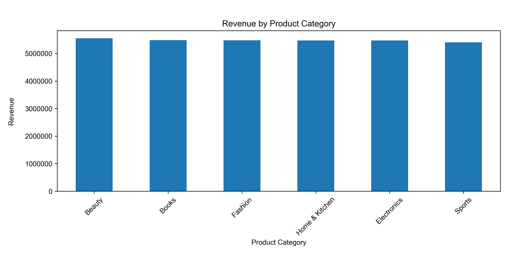
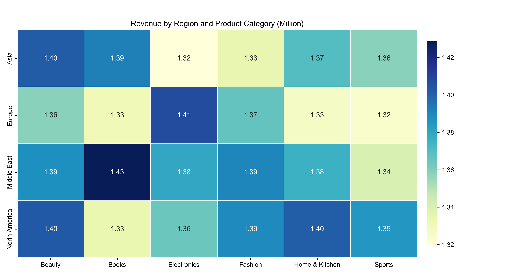
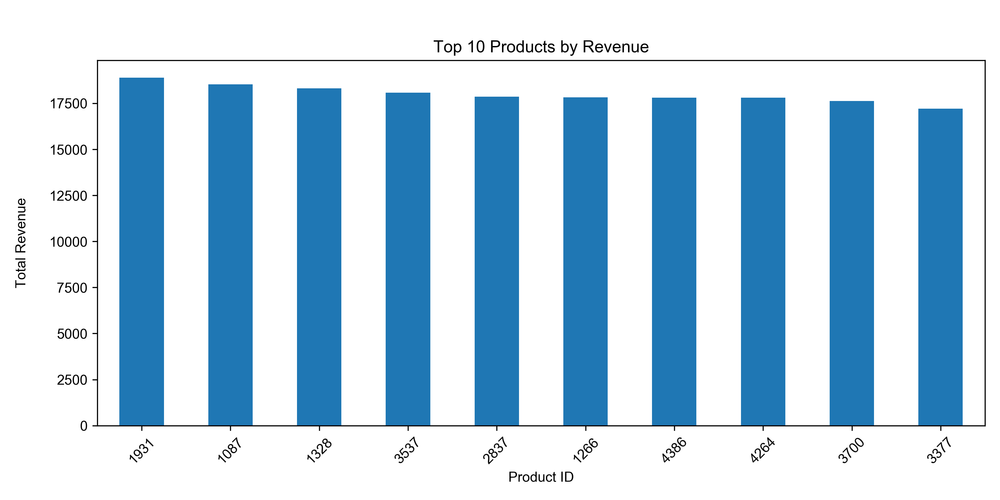

# Amazon Sales Data Analysis
This project analyzes the Amazon Sales Dataset from Kaggle using Python.
The main objective is to explore customer purchasing behavior, sales performance, payment methods, and product categories through exploratory data analysis (EDA), KPI analysis, and data visualization.
#Project Overview

## Dataset
- Source : Kaggle
- - File: `data/amazon_sales_dataset.csv
- 50,000 records
- 14 columns
- Sales transaction dataset

## Tools
- Python
- Pandas
- Matplotlib

## Analysis Process
- Data Cleaning
- EDA
- KPI Analysis
- Data Visualization

## Key Metrics
- Total Revenue
- Total Orders
- Average Order Value
- Average Rating

## Key Findings
- The Middle East generated the highest total revenue among all customer regions.
- Beauty products achieved the highest total revenue and sales volume.
- Books received the highest average customer rating.
- Wallet generated the highest revenue among all payment methods, while UPI (Unified Payments Interface) was the most popular payment method in Asia.
- Products with 300–400 reviews achieved the highest average revenue.
- January 2023 recorded the highest monthly revenue during the analysis period.
- Product ID 1931 generated the highest revenue, but appeared in multiple product categories, suggesting potential data quality issues.

## Results Preview

### KPI Dashboard

### Monthly Revenue Trend

### Revenue by Customer Region

### Revenue by Product Category

### Revenue Heatmap

### Top 10 Products by Revenue

## Business Insights
- Beauty products consistently outperformed other categories in both revenue and sales volume, indicating strong market demand.
- Customer preferences for payment methods differed by region, suggesting localized payment strategies may improve user experience.
- High review counts did not always correspond to higher revenue, indicating that product popularity alone does not guarantee sales performance.

## Future Improvements
- Create Power BI Dashboard
- Develop predictive sales models using machine learning.
- Create an automated reporting workflow.

